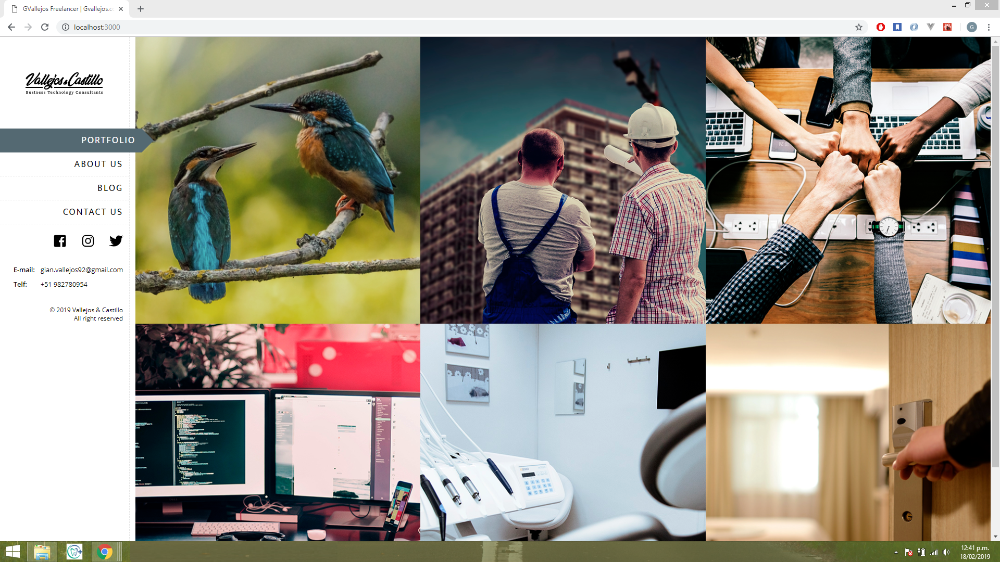
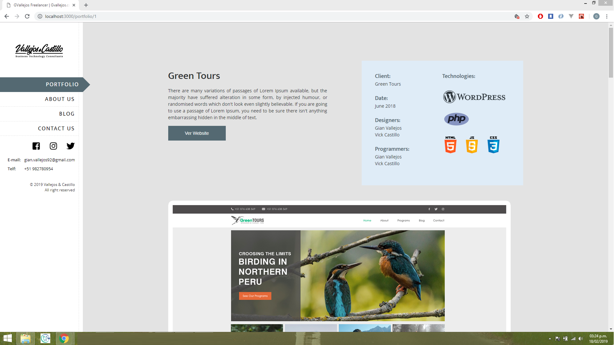
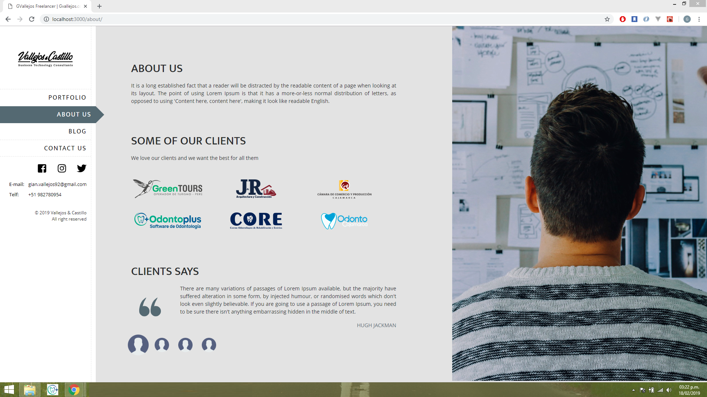
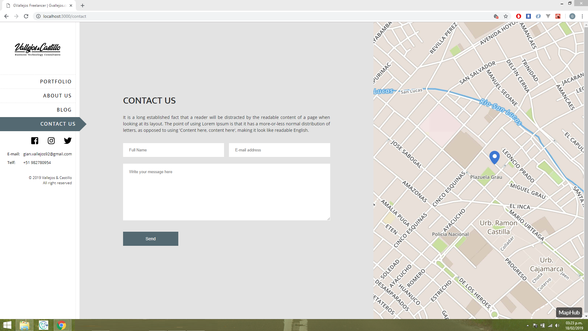

## Portfolio GVallejos

Proyecto personal para mostrar los trabajos que he realizado de una manera dinámica y sencilla.

## ¿Cómo funciona?

Requiere Composer, Node Js y Npm

* `composer install` para instalar dependencias de laravel
* `npm install` para instalar dependencias
* `php artisan serve` para ejecutar el proyecto en localhost:8000
* `npm run dev` para el entorno de desarrollo
* `npm run prod` para el entorno de producción

## Licencia
[MIT](https://opensource.org/licenses/MIT).
